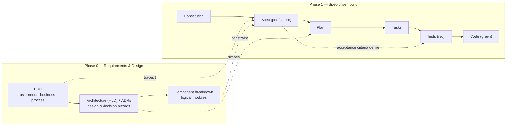

# AIDLC — AI-Driven Development Life Cycle

A spec-driven development workflow where documents — not code — are the source of truth.
Code is *generated from* and *kept consistent with* a layered stack of artifacts, so that:

1. Any feature can be traced from business need down to the line of code that implements it.
2. The artifact stack alone is sufficient for an AI agent (or a new team member) to regenerate the entire system.
3. Enhancements always enter through the documents first, never directly through the code.

This document is project-agnostic. Illustrative examples use a fictional internal
**expense-approval application**; substitute your own product wherever an example appears.

---

## 1. The two phases



- **Phase 0** produces the business and architectural context.
- **Phase 1** consumes it to produce feature specs, plans, tasks, and finally code.
- The **constitution** is derived from the PRD and architecture principles (the invariants),
  *before* component decomposition — components change over time; the constitution should not.

---

## 2. The artifact stack

Each layer owns exactly one abstraction level. No layer duplicates another —
information lives at exactly one level and is *referenced* (not copied) below it.

| # | Artifact | Owns | Agile equivalent | Example (expense-approval app) |
|---|---|---|---|---|
| 1 | **PRD** (`docs/prd.md`) | *Why* — business need, users, constraints, success measures | User requirements / epics | "Employees submit expenses from mobile; approval within 48 h; financial data never leaves the corporate tenant" |
| 2 | **Architecture HLD** (`docs/architecture.md`) | *What the design is* — components, data flow, tech stack | High-level design | Mobile client → API gateway → approval service → ledger database |
| 3 | **ADRs** (`docs/adr/`) | *Why this way* — one decision per file: context, options, choice, consequences | (often missing in agile!) | "Approval events via message queue for audit replay; rejected: direct DB writes" |
| 4 | **Component breakdown** (`docs/components.md`) | Logical modules to be built | Feature areas / workstreams | Submission form, receipt OCR, approval workflow engine, notifications, reporting |
| 5 | **Constitution** (`specs/constitution.md`) | *Never-break rules* — invariants that gate all future work | Enterprise guidelines, DoD, NFR principles | "Every financial mutation is audited; no PII in logs; all APIs versioned" |
| 6 | **Spec** (`specs/NNN-feature/spec.md`) | *What* — observable behavior as testable requirements with IDs | Jira user stories + acceptance criteria | "REQ-003: expenses over $500 require second-level approval" |
| 7 | **Plan** (`specs/NNN-feature/plan.md`) | *How* — component mapping, data flow, tech detail | Low-level design | "Threshold rule evaluated in workflow engine; limits read from policy table at request time" |
| 8 | **Tasks** (`specs/NNN-feature/tasks.md`) | *Steps* — ordered, verifiable work items traced to REQ IDs | Sprint backlog subtasks | "Task 3: implement second-level routing rule → REQ-003" |
| 9 | **Code** | Line-level implementation | Code | Application source |

### Key differences from classic agile

- **Specs are living, not ephemeral.** Jira tickets are closed and forgotten; the knowledge
  evaporates. AIDLC specs remain the current, authoritative description of system behavior
  and are amended whenever behavior changes. The spec is "the sum of all stories, kept
  continuously true."
- **The "why" is recorded.** ADRs capture rejected alternatives and consequences —
  exactly the knowledge that makes legacy systems hard to change when it's missing.
- **Machine-consumable.** The artifacts are structured so an AI agent can use them
  directly as generation input.

---

## 3. Repository layout

```
project/
├── docs/                          # Phase 0
│   ├── prd.md                     # product requirements
│   ├── architecture.md            # high-level design
│   ├── adr/                       # decision records (ADR-001, ADR-002, ...)
│   └── components.md              # logical component breakdown
├── specs/                         # Phase 1
│   ├── constitution.md            # project invariants
│   ├── 001-<feature-name>/
│   │   ├── spec.md                # WHAT: requirements + executable acceptance criteria
│   │   ├── plan.md                # HOW: design detail
│   │   └── tasks.md               # ordered implementation steps
│   └── 002-<next-feature>/
├── tests/                         # derived from specs (see §5)
│   ├── 001-<feature-name>/        # acceptance + unit tests traced to REQ IDs
│   └── 002-<next-feature>/
└── src/                           # generated / maintained code
```

---

## 4. Workflow for adding a new feature

Example feature: **per-project expense budgets**.

| Step | Action | Example |
|---|---|---|
| 1. **PRD update** | Add user need, constraints, success criteria | "Project managers need spend visibility against a budget per project" |
| 2. **Architecture check** | New/changed design decision → new ADR; new/changed component → update components.md. *Most small features skip this step.* | "ADR-007: budgets stored in policy service vs. new budget service" |
| 3. **Constitution gate** | Verify no invariant is violated. If it is: reject the feature, or consciously amend the constitution — never silently. | Budget mutations are audited ✅ |
| 4. **Spec** | New folder `specs/NNN-project-budgets/spec.md` with REQ IDs + **executable** acceptance criteria traced to the PRD (GIVEN/WHEN/THEN — see §5) | REQ-201: budget can be set per project; REQ-202: submission exceeding budget triggers warning; REQ-203: existing approvals unchanged |
| 5. **Plan** | How it fits the existing design; reference (don't restate) ADRs | Budget check added to workflow engine's rule chain; budgets read from policy table |
| 6. **Tasks** | Ordered, verifiable steps, each tagged with its REQ | "Task 1: add budget field to policy schema → REQ-201" |
| 7a. **Write tests (red)** | Generate failing tests from the spec's acceptance criteria — tests are derived, never invented at implementation time | Acceptance test: "GIVEN budget $1,000 and spend $990 WHEN a $20 expense is submitted THEN a warning is raised" |
| 7b. **Implement (green)** | Execute tasks one at a time; write minimal code until the task's traced tests pass, then refactor keeping tests green | Agent or human edits the code task-by-task |
| 8. **Close the loop** | Mark tasks done; set spec status to *implemented*; update user docs; if implementation deviated from the plan, update the plan/spec | Code and spec must not drift |

---

## 5. Test-driven development in AIDLC

Tests are not a separate phase — they are **derived artifacts** of the layers above.
TDD enforces two rules at two different points:

1. **Test definition happens at the spec level.** No REQ is accepted without a
   machine-verifiable acceptance criterion, written as an executable assertion:
   - Weak: "expenses over $500 require second-level approval"
   - TDD-ready: "GIVEN an expense of $500.01 WHEN submitted THEN status = `pending_l2`"
2. **Test writing is the first step of implementation** (step 7a). Each task follows
   red→green→refactor, and a task is *done* only when its traced tests pass. If an
   implementer has to invent a test, the spec's acceptance criteria are incomplete —
   that is an upward defect against the spec, not a gap for the implementer to fill.

The test pyramid maps directly onto the artifact stack:

| Test type | Derived from | Verifies |
|---|---|---|
| Acceptance / E2E tests | `spec.md` REQ acceptance criteria | The feature does what the spec says |
| Integration tests | `plan.md` component interactions | The design boundaries work as planned |
| Unit tests | `tasks.md` individual work items | Each step's local behavior |

This makes tests the **executable form of the drift check** (§7): if code diverges from
the spec, a spec-derived test fails automatically.

Where behavior cannot be tested automatically (OS-level integration, hardware, UI
gestures), the spec must say so explicitly: the REQ is tagged *manual* and its
acceptance criterion becomes a step in a manual test checklist kept in the spec folder.
Manual REQs are the exception and each one must justify why automation is impossible.

---

## 6. Entry tiers — where a change starts

The pipeline always flows **downward**, but not every change enters at the top.
A change enters at the **highest level it actually affects**, and everything below
that level must then be updated.

| Change type | Entry point | Example |
|---|---|---|
| New capability / changed user behavior | Step 1 — PRD | "Support multi-currency expenses" |
| Same behavior, different design | Step 2 — Architecture/ADR | "Replace polling with event-driven notifications" |
| Same behavior, same design, internal detail | Steps 4–6 — Spec/Plan/Tasks | "Adjust the OCR confidence threshold because valid receipts get rejected" (bug fix against an existing REQ) |

Under TDD, spec-level bug fixes start by updating the acceptance criterion, whose
regenerated test now fails — the fix is complete when it passes again.

Two rules keep this consistent:

1. **Enter at the right level, then flow down.** If you enter at the spec level,
   spec → plan → tasks → code all get updated. Downward layers are never skipped.
2. **Never contradict upward.** If a "small fix" turns out to conflict with an ADR or
   the constitution (e.g., it requires network access in an offline-only product),
   it wasn't a small fix — promote it to the appropriate upper level first.

> A feature request **never starts at the code.** Even a one-line change enters at the
> spec level. Steps 4–6 can take minutes for small features; steps 1–2 are only needed
> when the change is user- or architecture-visible.

---

## 7. Quality bars

- **Regeneration test (completeness):** if all code were deleted today, the artifact
  stack must contain enough information for an agent to regenerate functionally
  equivalent code. If it can't, a layer is missing detail.
- **Single source per fact (consistency):** every fact lives at exactly one level and is
  referenced below. (The approval-threshold *value* lives in the spec; the plan references
  REQ-003 rather than restating "$500".) This prevents the drift that kills most
  documentation efforts.
- **Drift is a defect:** any mismatch between a layer and the layer below it —
  including code — is treated as a bug and fixed like one.
- **Every REQ is executable:** each requirement has at least one acceptance criterion
  expressible as an automated test (or is explicitly tagged *manual* with justification).
- **Done means green:** a task is complete only when the tests traced to its REQs pass;
  a feature is complete only when all its acceptance tests pass.
- **Deliberately out of scope:** line-level choices (variable names, loop structure)
  belong to the code. Regeneration may produce different-looking but behaviorally
  identical implementations.

---

## 8. Tooling options

| Option | What you get | When to choose |
|---|---|---|
| **GitHub Spec Kit** (`specify init`) | `/speckit.constitution`, `/speckit.specify`, `/speckit.plan`, `/speckit.tasks`, `/speckit.implement` slash commands in Copilot Chat; templates and guardrails built in | You want a guided, navigable workflow with tooling support |
| **Lightweight custom** | Just the folder structure in §3 plus a `.github/copilot-instructions.md` telling agents to always read/update specs before touching code | You want zero tooling dependency and full control |

---

## 9. Summary

```
Business need ──► PRD ──► HLD + ADRs ──► Components
                                            │
                     Constitution ◄─────────┘  (invariants distilled from PRD + ADRs)
                          │
                     Spec (REQ-IDs + executable acceptance criteria)
                          │
                     Plan (low-level design)
                          │
                     Tasks (traced to REQs)
                          │
                     Tests (red — derived from acceptance criteria)
                          │
                     Code (green — minimal code until tests pass)
```

- Documents are the source of truth; code is a derived artifact.
- Every change enters at the highest affected layer and flows down.
- Full traceability: business requirement → REQ-ID → test → task → code, and ADR → plan → code.
- Tests are derived from acceptance criteria (TDD): red before code, green means done.
- The payoff: any AI agent or new engineer can understand, extend, or regenerate the
  system from the documents alone.
